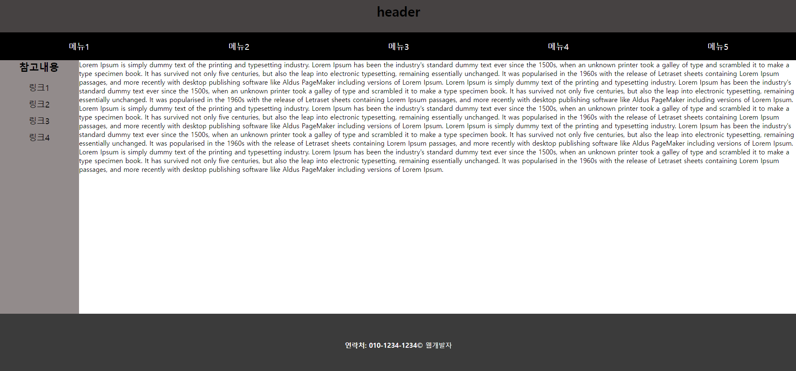

# HTML이란?
- HTML (Hypertext Markup Language,하이퍼텍스트 마크업 언어)는 프로그래밍 언어는 아니고,
  우리가 보는 웹페이지가 어떻게 구조화되어 있는지 브라우저로 하여금 알 수 있도록 하는 마크업 언어입니다.

## HTML의 구조
```html
<!DOCTYPE html>
<html>
<head>
    <!-- 문서 정보를 나타내는 부분 -->
    <title>HTML</title>
</head>
<body>
    <!-- HTML 문서 내용을 작성하는 부분 -->
    <h2>HTML</h2>
    <p>
        이 부분은 문서 내용을 작성하는 <br />
        부분입니다.
    </p>
</body>
</html>
```
- `<!DOCTYPE html>`
    - HTML5라는 의미입니다. DOCTYPE 선언은 HTML 문서에서 `<html>` 태그를 정의하기 전에 가장 먼저 선언되어야만 합니다.
    - html5는 스마트폰 때문에 생겼습니다.
- `<html></html>`
    - html파일의 시작과 끝을 의미합니다.
- `<head></head>`
    - html파일의 머리부분으로 문서의 정보를 나타내고 내/외부 파일을 연결하는 코드를 작성하는 부분입니다.
- `<body></body>`
    - html파일의 몸통부분으로 문서의 내용을 작성하는 부분입니다.
- `<!-- -->`
    - html에 주석을 삽입할 때 사용합니다.
    - 주석이란 소스 코드에 개발자가 해당 코드 부분의 이해를 돕는 설명을 추가하거나 디버깅을 위해 삽입한 구문을 의미합니다.
    - 주석 태그는 브라우저가 해석하지 않으므로 브라우저 화면에서는 확인할 수 없다.
    - 개발자 본인이나 다른 사람이 나중에 소스 코드를 수정하거나 분석하려고 할 때 유용하게 사용될 수 있습니다.

## HTML의 요소 표현
- html의 요소들은 '<'와 '>'로 둘러싼 태그표현을 이용해서 시작을 나타내고 '<'와 '/>'로 둘러싼 태그표현을 이용해서 끝을 나타냅니다.
- `<h1 id="title">HTML</h1>` : <시작태그 속성명="속성 값">요소내용</종료태그>
- 속성값은 여러개일 수 있고 시작태그와 종료태그를 작성하는것이 아니고 <태그명 /> 혹은 <태그명>으로 작성하는 경우도 있습니다. (요소의 내용이 없는 경우)
- 태그를 나타낼 때는 영문 대/소문자를 구분하지 않습니다.
- 하나 이상의 연속된 공백문자들과 엔터키 입력들은 웹브라우저로 출력될 때 하나의 공백문자만 인식해서 출력합니다.
- ex)
```html
, <hr>
```
- 요소안에 여러개의 요소를 작성할 수 있습니다.
```html
<h1><a href="#">로고</a></h1>
```

## 태그
### html5 요소
요소 | 예
-- | --
글자 | \<strong>, \<b>, \<i>, \<underline>, \<sub>, \<super>
문단 | \<h1>~\<h6>, \<pre>, \<p>, \<br>, \<hr>, \<ol>, \<ul>, \<li>, \<table>
멀티미디어 | \, \<audio>, \<video>
하이퍼링크 | \<a>
외부파일 | \<iframe>, \<object>, \<embed>
문서 레이아웃 설계 | \<div>, \<span>
입력 | \<form>, \<input>, \<select>, \<textarea>, \<label>, \<button> 등
시맨틱문서 | \<header>, \<nav>, \<section>, \<article>, \<aside>, \<footer> 등

### text와 문단 표시
구분 | 태그
-- | --
`제목` | h1 ~ h6
`단락` | p
입력형태 그대로 | pre
수평선 | hr
`줄 바꿈` | br
텍스트 형태 | b, i, strong, sub, sup

## 웹 브라우저에 문서내용 출력하기
---

<br />
```html
<h1>h1 요소를 사용</h1>
<h2>h2 요소를 사용</h2>
<h3>h3 요소를 사용</h3>
<h4>h4 요소를 사용</h4>
<h5>h5 요소를 사용</h5>
<h6>h6 요소를 사용</h6>
<hr />
<p>
    &lt;p&gt;<br />
    &nbsp;&nbsp;HTML (Hypertext Markup Language,하이퍼텍스트 마크업 언어)는 프로그래밍 언어는 아니고, <br />
    &nbsp;&nbsp;우리가 보는 웹페이지가 어떻게 구조화되어 있는지 브라우저로 하여금 알 수 있도록 하는 마크업 언어입니다.<br />
    &lt;p&gt;
</p>
<strong>
    &lt;strong&gt;<br />
    &nbsp;&nbsp;해당 콘텐츠의 중요성이나 심각함, 긴급함 등을 강조할 때 사용<br />
    &nbsp;&nbsp;콘텐츠 자체의 중요성을 강조할 때 사용<br />
    &nbsp;&nbsp;문장의 일부분에 중요성을 추가하는데 사용<br />
    &lt;/strong&gt;
</strong> <br />
<b>&lt;b&gt;요소는 콘텐츠의 중요성보다는 텍스트 자체에 주의를 끌기 위해 사용&lt;/b&gt;</b> <br />
<em>&lt;em&gt;요소는 구어체 강조와 같이 문장의 의미를 변경하는데 사용&lt;/em&gt;</em>
```

### \<pre>
```
메모장과 같은 텍스트 편집기에서 입력했을 때와 같이 그대로 나타냅니다.
```
```html
    <pre>
        HTML 웹 문서를
작성하는 표준 언어입니다.
            태그를 사용했습니다.

            
        &lt;p&gt;이 태그는 그대로 출력됩니다.&lt;/p&gt;
        &lt;div&gt;이 태그도 그대로 출력됩니다.&lt;/div&gt;
  &lt;span style="color: red;"&gt;이 스타일도 그대로 출력됩니다.&lt;/span&gt;
    </pre>
```

## 리스트

tag | 설명 | 속성
-- | -- | --
ul | 글머리 기호 표시 **비순서리스트** | type="disc or circle or square"
ol | **순서 표시 리스트** | type="1 or A or a or I" start="시작번호"
li | 항목 | value="표시번호"

### **ex1**


---
### code
```html
<h3>순서 필요 x</h3>
<ul type="circle">
    <li>사과</li>
    <li>딸기</li>
    <li>키위</li>
    <li>바나나</li>
    <li>수박</li>
</ul>
<hr>
<h3>순서 필요 o</h3>
<ul>
    <li>축구</li>
    <ol type="A">
        <li>토트넘</li>
        <li>맨유</li>
        <li>리버풀</li>
        <li>아스널</li>
        <li>맨시티</li>
    </ol>
    <li>야구</li>
    <ol start="3">
        <li>KT</li>
        <li>삼성</li>
        <li>LG</li>
        <li>두산</li>
        <li>키움</li>
    </ol>
</ul>
```

## 표
### html tag
태그명 | 의미 및 관련 속성
-- | --
table | 표 표시<br>border: 표 테두리선 표시
tr | 표의 한 행 표시<br>rowspan: 같은 열의 셀들을 합침.<br>colspan: 같은 행의 셀들을 합침.
th | 제목 셀 표시
td | 내용 셀 표시

### **ex2**  


---
### code
```html
<table border="1">
    <tr>
        <td>시간</td>
        <td>월</td>
        <td>화</td>
        <td>수</td>
        <td>목</td>
        <td>금</td>
    </tr>
    <tr>
        <td>1교시</td>
        <td>국어</td>
        <td>수학</td>
        <td>영어</td>
        <td>과학</td>
        <td>체육</td>
    </tr>
    <tr>
        <td>2교시</td>
        <td>역사</td>
        <td>미술</td>
        <td>사회</td>
        <td>영어</td>
        <td>체육</td>
    </tr>
    <tr>
        <td>3교시</td>
        <td>영어</td>
        <td>국어</td>
        <td>수학</td>
        <td>수학</td>
        <td>체육</td>
    </tr>
    <tr>
        <td>4교시</td>
        <td>수학</td>
        <td>영어</td>
        <td>국어</td>
        <td>국어</td>
        <td>체육</td>
    </tr>
</table>
```

### 시맨틱 태그
태그명 | 의미
-- | --
caption | 제목 표시
thead | 표의 시작 셀 부분
tbody | 내용 셀 부분
tfoot | 표의 마지막 부분(요약 셀들)

### **ex3**  


---
### code
```html
<table border="1">
    <caption>학생 종합 성적표</caption>
    <thead>
        <tr>
            <th>구분</th>
            <th>학생1</th>
            <th>학생2</th>
            <th>학생3</th>
            <th>학생4</th>
        </tr>
    </thead>
    <tbody>
        <tr>
            <td>중간</td>
            <td>80</td>
            <td>70</td>
            <td>90</td>
            <td>100</td>
        </tr>
        <tr>
            <td>기말</td>
            <td>50</td>
            <td>100</td>
            <td>80</td>
            <td>100</td>
        </tr>
        <tr>
            <td>수행</td>
            <td>90</td>
            <td>90</td>
            <td>60</td>
            <td>100</td>
        </tr>
    </tbody>
    <tfoot>
        <tr>
            <td>합계</td>
            <td>220</td>
            <td>250</td>
            <td>230</td>
            <td>300</td>
        </tr>
        <tr>
            <td>평균</td>
            <td>73</td>
            <td>83</td>
            <td>76</td>
            <td>100</td>
        </tr>
    </tfoot>
</table>
```

### 행, 열 셀 합치기


---
### code
```html
<table border="1">
    <tr>
        <td>시간</td>
        <td>월</td>
        <td>화</td>
        <td>수</td>
        <td>목</td>
        <td>금</td>
    </tr>
    <tr>
        <td>1교시</td>
        <td></td>
        <td rowspan="2">JAVA</td>
        <td></td>
        <td colspan="2">영어</td>
    </tr>
    <tr>
        <td>2교시</td>
        <td rowspan="3">웹 프로그래밍</td>
        <td rowspan="2">MySQL</td>
        <td></td>
        <td></td>
    </tr>
    <tr>
        <td>3교시</td>
        <td></td>
        <td colspan="2" rowspan="2">자습</td>
    </tr>
    <tr>
        <td>4교시</td>
        <td></td>
        <td></td>
    </tr>
</table>
```

# HTML 요소의 표시 공간
- 라인 블록 요소 : `<div>`, `<h1>~<h6>`, `<p>`, `<pre>`, `<ul>`, `<ol>`, `<table>`, `<form>`, ...
    - 블록(block)인 요소는 언제나 새로운 라인(line)에서 시작하며, 해당 라인의 모든 너비를 차지
    - `<div>`요소는 다른 HTML 요소들을 하나로 묶는 데 자주 사용되는 대표적인 블록(block) 요소입니다.
    - `<div>`요소는 주로 여러 요소들의 스타일을 한 번에 적용하기 위해 사용됩니다.

- 인라인 블록 요소 : `<span>`, `<a>`, ``, `<input>`, `<select>`, ...
    - 인라인(inline)인 요소는 새로운 라인(line)에서 시작하지 않습니다.
    - 요소의 너비도 해당 라인 전체가 아닌 해당 HTML 요소의 내용(content)만큼만 차지합니다.
    - `<span>`요소는 텍스트(text)의 특정 부분을 묶는 데 자주 사용되는 인라인(inline) 요소입니다.
    - `<span>`요소는 주로 텍스트의 특정 부분에 따로 스타일을 적용하기 위해 사용됩니다.

- **`<div>`와 `<span>` 테그의 같은 점은 범위를 지정한다는 것이 같고 `<div>`태그는 표시 공간을 라인블럭으로 지정하고, `<span>`태그는 표시 공간을 인라인 블럭으로 지정한다.**
## html page
- 시맨틱 태그들

    요소 | 의미
    -- | --
    `<header>` | 문서 시작 부분
    `<nav>` | 문서의 메인 링크 부분(주메뉴)
    `<aside>` | 문서 왼쪽/오른쪽 부분(서브메뉴)
    `<article>` | 문서 내용 부분(대분류)
    `<section>` | 문서 내용 부분(소분류)
    `<footer>` | 문서 마지막 부분
```html
<header>
    <h1>header</h1>
    <nav>
        <ul>
            <li><a href="/">메뉴1</a></li>
            <li><a href="/">메뉴2</a></li>
            <li><a href="/">메뉴3</a></li>
            <li><a href="/">메뉴4</a></li>
            <li><a href="/">메뉴5</a></li>
        </ul>
    </nav>
</header>
<aside>
    <h3>참고내용</h3>
    <ul>
        <li><a href="/">링크1</a></li>
        <li><a href="/">링크2</a></li>
        <li><a href="/">링크3</a></li>
        <li><a href="/">링크4</a></li>
    </ul>
</aside>
<section>
    Lorem Ipsum is simply dummy text of the printing and typesetting industry. Lorem Ipsum has been the industry's standard dummy text ever since the 1500s, when an unknown printer took a galley of type and scrambled it to make a type specimen book. It has survived not only five centuries, but also the leap into electronic typesetting, remaining essentially unchanged. It was popularised in the 1960s with the release of Letraset sheets containing Lorem Ipsum passages, and more recently with desktop publishing software like Aldus PageMaker including versions of Lorem Ipsum.
</section>
<footer>
    <h4>연락처: 010-1234-1234</h4> <span>&copy; 웹개발자</span>
</footer>
```

### css 입히기
```css
body {
    margin: 0 auto;
    padding: 0;
}

h1,h2,h3,h4,h5,h6 {
    margin: 0;
}

ul {
    list-style: none;
    padding: 0;
}

a {
    text-decoration: none;
    color:#000;
}

header {
    width: 100%;
    height: 150px;
    background: #464242;
    display: flex;
    flex-direction: column;
    align-items: center;
    justify-content: flex-end;
}

nav {
    background: #000;
    color: #fff;
    width: 100%;
    margin-top: 30px;
    font-size: 20px;
}

#menu {
    display: flex;
    justify-content: space-around;
}
.link {
    color: #fff
}

#wrap {
    width: 100%;
    display: flex;
    height: 67.1vh;
}

#subMenu {
    width: 10%;
    text-align: center;
    background: #928b8b;
}

#subMenuList {
    font-size: 20px;
}

#subMenuList > li {
    height: 30px;
    margin-bottom: 10px;
}

#content {
    width: 90%;
}

footer {
    background: #3b3b3b;
    color: #fff;
    height: 150px;
    display: flex;
    align-items: center;
    justify-content: center;
}
```



## 시맨틱 태그 사용


## 레이아웃

### **ex1**


### **HTML**
```html
<div id="wrap">
    <header>
        <div id="header">
            <div class="container">header</div>
        </div>
        <nav>
            <div class="container">nav</div>
        </nav>
    </header>
    <div id="banner">
        <div class="container">banner</div>
    </div>
    <section id="contents">
        <section id="content1">
            <div class="container">content1</div>
        </section>
        <section id="content2">
            <div class="container">content2</div>
        </section>
        <section id="content3">
            <div class="container">content3</div>
        </section>
    </section>
    <footer>
        <div class="container">footer</div>
    </footer>
</div>
```
---
### **CSS**
```css
/*리셋*/
*{
    margin: 0; padding: 0;
}

/*컨테이너*/
.container{
    width: 1200px;
    margin: 0 auto;
    height: inherit;
    background: rgba(0,0,0,0.3);
}

/*전제 레이아웃*/
#wrap{
    width: 100%;
    font-size: 20px;
    color: #fff;
    text-align: center;
}
header{
    width: 100%;
    height: 140px;
}
#banner{
    width: 100%;
    height: 450px;
    line-height: 450px;
    background: #f48fb1;
}
#contents{
    width: 100%;
    height: 950px; 
}
footer{
    width: 100%;
    height: 220px;
    line-height: 220px;
    background: #d81b60;
}

/*레이아웃*/
#header{
    width: 100%;
    height: 70px;
    line-height: 70px;
    background: #fce4ec;
}
nav{
    width: 100%;
    height: 70px;
    line-height: 70px;
    background: #f8bbd0;
}
#content1{
    width: 100%;
    height: 90px;
    line-height: 90px;
    background: #f06292;
}
#content2{
    width: 100%;
    height: 480px;
    line-height: 480px;
    background: #ec407a;
}
#content3{
    width: 100%;
    height: 380px;
    line-height: 380px;
    background: #e91e63;
}
```

## 폼
```
form태그는 여러 입력 항목들을 그룹핑하여 한 입력 양식을 정의하고, 입력된 데이터들을 웹서버로 전달할 때 필요한 정보(전달방식, 전달 대상 등)를 속성으로 지정합니다.
```
- form 태그의 속성

    속성명 | 설명
    -- | --
    `action` | 사용자가 입력한 데이터들을 전달받는 웹 서버의 처리 프로그램을 지정하는 것<br />(일반적으로 C 등으로 작성된 CGI프로그램 실행 파일이나 PHP, JSP, ASP 등으로 작성된 스크립트 파일)
    `method` | 입력된 데이터들을 웹 서버로 전달하는 방식을 지정하는 것<br/>- `post방식`: 데이터를 HTTP Request 전송 객체를 통해 전달하여 get방식과는 달리 전달되는 데이터들이 노출되지 않습니다.<br/>- `get방식`: 데이터를 URL 뒤에 "변수명=데이터" 형식으로 붙여 웹서버에게 전달합니다.<br />`default값 : post방식`
- 입력양식 tag

    입력태그 | 설명
    -- | --
    `input` | 텍스트(문자) 입력 항목
    `textarea` | 텍스트(문장) 입력 항목
    `select`, `option` | 드롭박스 형식의 선택 항목 입력필드
    `button` | 버튼입력
    `label` | 입력 항목의 의미를 나타내는 라벨
    `fieldset` | 입력 필드들의 그룹핑을 정의
    `legend` | 입력필드 그룹핑에 대한 그룹라벨
---
- `<input>` 요소에서 자주 사용되는 type 속성값들

    type 속성값 | 설명
    -- | --
    text | 텍스트 입력필드를 표시
    password | 텍스트 입력필드(*** 표시)를 표시
    radio | 라디오 버튼(**단일 선택**) 선택 항목을 표시
    checkbox | 체크박스(**다중 선택**) 선택 항목을 표시
    file | 파일명 입력 대화상자를 표시
    reset | 초기화 버튼, 사용자의 모든 입력내용을 초기화
    submit | 데이터 전송 버튼, 입력된 데이터를 웹 서버로 전송

### **ex1**


### **code**

```html
<h2>성적 입력 & 조회</h2>
<pre>
    <form>
        학      과 : <input type="text" name="major" value="학과명">
        이      름 : <input type="text" name="name" value="">
        중간  성적 : <input type="text" name="middle">
        기말  성적 " <input type="text" name="last">
        <input type="submit" value="처리결과 조회">
        <input type="reset" value="입력취소">
    </form>
</pre>
```

### **ex2**


### **code**

```html
<form>
    아 이 &nbsp;디 : <input type="text" name="id" size="15" value="ID입력하세요"><br>
    패스워드 : <input type="password" name="passwd" id="p" size="15"><br>
    성    별 : <input type="radio" name="gender">남성
                <input type="radio" name="gender">여성<br>
    학    년 : <input type="radio" name="grade">1학년
                <input type="radio" name="grade">2학년<br>
    취    미
    <input type="checkbox" name="sport1">야구
    <input type="checkbox" name="sport2">축구
    <input type="checkbox" name="sport3">농구
    <input type="checkbox" name="sport4">테니스<br>

    <input type="submit" value="로그인" /><input type="reset" value="입력취소" />
</form>
```

### **ex3**


### **code**

```html
과제제출 <br><br>
<form>
    제출자 : <input type="text" name="id">&nbsp;&nbsp;
    [첨부파일]<input type="file" name="filename">

    <input type="submit" value="과제제출"><input type="reset" value="입력취소">
</form>
```

### **ex4**


### **code**

```html
button<br><br>
<form>
    <a href="https://www.w3schools.com/html/" target="_blank">
        <button type="button">Lean HTML</button>
    </a>
    <a href="https://www.w3schools.com/css/" target="_blank">
        <button type="button">Lean CSS3</button>
    </a>
    <a href="https://www.w3schools.com/js/" target="_blank">
        <button type="button">Lean Javascript</button>
    </a>

    <button type="button" onclick="alert('버튼을 클릭했습니다');">click me
    </button><br><br>
    글남기기 : <input type="text" name="user" size="35">
    <button type="submit">저장</button>
    <button type="reset">지우기</button>
</form>
```

### **ex5**


### **code**

```html
여행 선택<br><br>
<form>
    국가<select name="country" multiple>
        <option value="a1">프랑스</option>
        <option value="a2">한국</option>
        <option value="a3">미국</option>
        <option value="a4">호주</option>
        </select><br><br>
    도시<select name="city" size="3" multiple>
        <option value="a">서울</option>
        <option value="부산">부산</option>
        <option value="광주">광주</option>
        <option value="인천">인천</option>
        <option value="수원">수원</option>
        <option value="안양">안양</option>
        </select><br>
    <button type="submit">데이터전송</button>
</form>
```

### **ex6**


### **code**

```html
회원정보<br><br>
<form style="width: 700px;">
    <fieldset>
    <legend>인적사항</legend>
        이름 : <input type="text" name="name" size="10" value=""><br>
        주민번호: <input type="text" name="jumin-1" size="6" value="">-
                    <input type="text" name="jumin-2" size="7" value=""><br>
        국적 : <select>
                <option>한국</option>
                <option>중국</option>
                <option>일국</option>
                <option>미국</option>
                <option>영국</option>
                </select>
    </fieldset>
    <fieldset>
        <legend>성별</legend>
                성    별 : <input type="radio" name="gender">남성
                            <input type="radio" name="gender">여성<br>
    </fieldset>
    <fieldset>
        <legend>학년</legend>
                학    년 : <input type="radio" name="grade">1학년
                        <input type="radio" name="grade">2학년
                        <input type="radio" name="grade">3학년
    </fieldset>
    <fieldset>
        <legend>이메일 입력</legend>
            이메일 : <input type="email" placeholder="mygod@hytu.ac.kr" name="mail">
            웹주소 : <input type="url" placeholder="http://www.yuhan.ac.kr" name="address">
    </fieldset>
    <fieldset>
        <legend>취미</legend>
            <input type="checkbox" name="sport">야구
            <input type="checkbox" name="sport">축구
            <input type="checkbox" name="sport">농구
            <input type="checkbox" name="sport">테니스
    </fieldset>
    <fieldset>
        <legend>메모를 남기세요</legend>
            <textarea rows="5" cols="50" name="memo">
            
            </textarea><hr>
    </fieldset><br>
    <input type="submit" value="저장"><input type="reset" value="입력취소">
</form>
```

## input 요소의 고급 type 속성값
type 속성값 | 설명
-- | --
email | 'xxx@xxx.xxx' 형식입력
URL | '프로토콜://IP_주소/경로명/파일명' 형식 입력
tel | pattern 속성으로 지정한 전화번호 형식 입력
search | 검색어 입력필드
date | 년-월-일 형태의 달력 입력
month | 년-월 형태의 달력 입력
week | 년-주 형태의 달력 입력
time | 시간 입력 필드
datetime | 국제표준 시간대의 날짜 및 시간 입력 필드
datetime-local | 지역 표준시간대의 날짜와 시간 입력 필드
number | 수치입력 필드
range | 스크롤 바 형태의 수치범위 입력필드
color | 색상 선택 대화상자 입력
button | 버튼 입력, `<a>` 태그와 함께 사용함
image | 이미지 버튼입력, `<a>` 태그와 함께 사용함
hidden | 사용자에게 숨기고 웹 서버에게 전달할 데이터를 나타냄

### **ex7**


### **code**

```html
<form style="width: 300px;">
    <fieldset>
        <legend>검색어</legend>
        검색어 : <input type="search" name="keyword">
    </fieldset>
    <input type="submit" value="저장"><input type="reset" value="입력취소">
</form>
```

### **ex8**


### **code**

```html
<form style="width: 300px;">
    <fieldset>
        <legend>DATE</legend>
            회의일자 : <input type="date" name="mday">
    </fieldset>
    <fieldset>
        <legend>WEEK</legend>
            회의일자 : <input type="week" name="mday">
    </fieldset>
    <fieldset>
        <legend>MONTH</legend>
            회의일자 : <input type="month" name="mday">
    </fieldset>
    <fieldset>
        <legend>Time</legend>
            회의 시간 : <input type="time" name="mtime">
    </fieldset>
    <fieldset>
        <legend>DateTime</legend>
            회의 시간 : <input type="datetime" name="mtime">
    </fieldset>
    <fieldset>
        <legend>DateTime-local</legend>
            회의 시간 : <input type="datetime-local" name="mtime">
    </fieldset>

    <input type="submit" value="저장"><input type="reset" value="입력취소">
</form>
```

### **ex9**


### **code**

```html
<form style="width: 300px;">
    <fieldset>
        <legend>숫자</legend>
            나이는 : <input type="number" min="0" max="100" step="1" value="20">
    </fieldset>
    <fieldset>
        <legend>범위 값</legend>
            성적 : <input type="range" min="0" max="100" step="5" value="50">
    </fieldset>
    <fieldset>
        <legend>색상 선택</legend>
            색상 : <input type="color" value="#ff0000">
    </fieldset>
    <input type="submit" value="저장"><input type="reset" value="입력취소">
</form>
```

## html5에 추가된 input 속성
속성 | 설명
-- | --
list | 입력 가능한 값들을 목록 형식으로 제공함
required | 필수 입력 필드로 지정함
autofocus | 입력 필드를 입력가능 상태로 지정함
placeholder | 입력 예시를 나타냄
disabled | 입력 불가능 상태로 지정함
autocomplete | 이전의 입력내용을 제공함

### list 사용

### code
```html
<form style="width: 500px">
    <fieldset>
        <legend>데이터리스트 속성</legend>
        전공 : <input type="text" list="major">
        <datalist id="major">
            <option value="컴퓨터공학과"/>
            <option value="기계공학과"/>
            <option value="정보통신학과"/>
            <option value="전기공학과"/>
            <option value="건축공학과"/>
        </datalist>
    </fieldset>
</form>
```